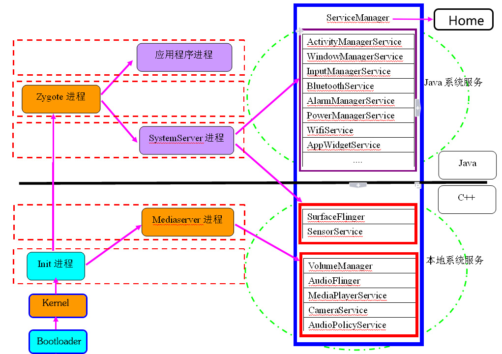
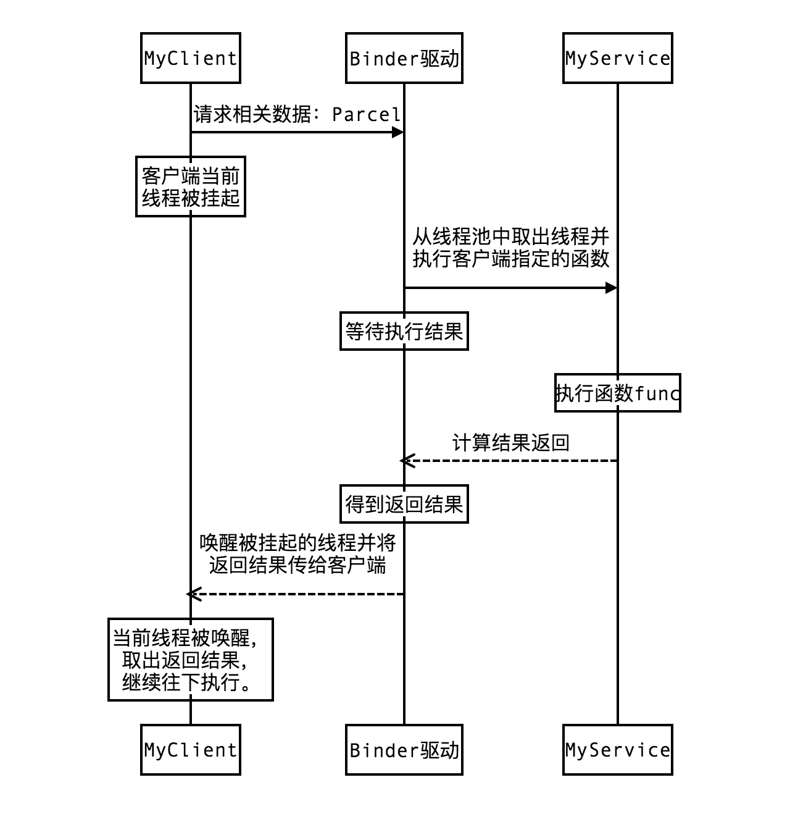
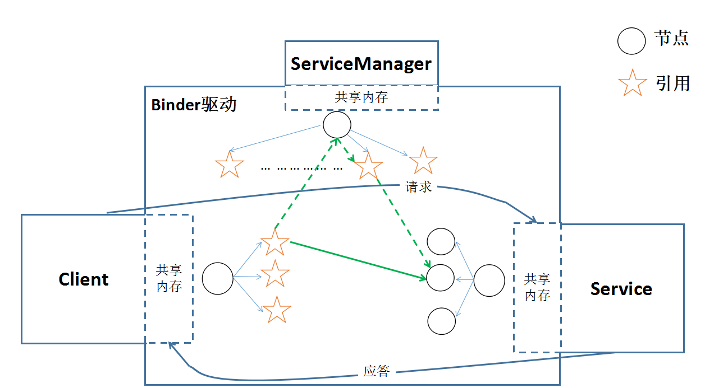
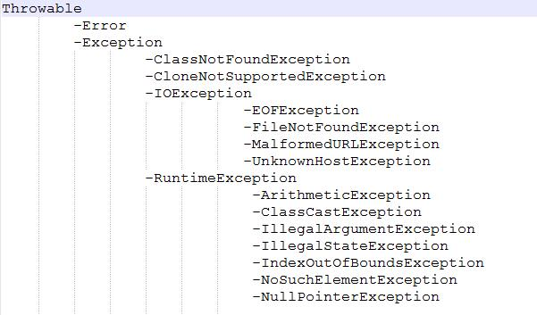

## 复习要点

+ [ X ] Android基础知识复习
+ [ X ]  Java基础知识复习
+ [ X ] 网络知识点复习
+ [ ] 设计模式
+ [ ] 数据结构
+ [ ] 基础算法
+ [ ] Android项目复习
+ [ ] RN知识点复习


## Android知识点复习要点

- `View绘制流程`：Android的View绘制是从根节点（Activity是从DeorcView）开始，它是一个自上而下的过程。 
	- `ViewRootImpl`类的`performTraversals()方法`，根据之前的设置状态，判断是否重新计算视图大小(`measure`)、是否重新放置视图位置(`layout`)、以及是否重绘(`draw`)

	- `measure`流程图

	- `layout`流程图
	- `draw`流程图
 
- `DecorView`
- `IPC通信`
- `IntentService/Service`
	- IntentService是Service子类，创建独立的工作线程来异步处理请求。所有Intent请求处理完成后，系统会自动关闭服务，不需要调用stopSelft()来结束服务
	- Service的方法在UI线程执行 
- `Activity/Fragment生命周期（销毁和恢复）`
	- Fragment生命周期
		- onAttach()：当fragment被绑定到activity时调用
		- onCreate()
		- onCreateView()：将本身的布局构建到activity中去（fragment作为activity界面的一部分）
		- onActivityCreated()：当activity的onCreate()函数返回时被调用
		- onStart()
		- onResume()
		- onPause()
		- onStop()
		- onDestroyView()：当与fragment关联的视图体系正被移除时被调用
		- onDestroy()
		- onDetach()：当fragment正与activity解除关联时被调用  
- `Activity taskAffinity/flags/task`
	- `taskAffinity`：任务相关性，该参数标识了一个Activity所需的任务栈的名字。默认情况下，所有Activity所需的任务栈的名字为应用的包名。TaskAffinity属性主要与SingleTask启动模式或者allowTaskReparenting属性配对使用，在其他情况下没有意义 
		- 当TaskAffinity和singleTask启动模式配对使用的时候，它是具有该模式的Activity的当前任务栈的名字，待启动的Acitivity会运行在名字和TaskAffinity相同的任务栈中
		- 当TaskAffinity与allowTaskReparenting结合时，情况比较复杂，会产生特殊效果。A==> B.C ==> Home ==> B ==> show B.C not B.main
	- `Flags`
		- FLAG_ ACTIVITY _  NEW _TASK：singleTask模式相同
		- FLAG_ ACITIVIYT _ SINGLE _TOP：singleTop模式相同
		- FLAG_ ACTIVITY _ CLEAR _TOP：此模式在launchMode中没有对应的属性值。如果要启动的activity已经在当前的task运行则不在启动新的实例，且所有在其上面的activity将被销毁
		- FLAG_ ACTIVITY _ EXCLUDE _ FROM _RECENTS：具有这个标志的Activity不会出现在历史Activity列表中  
- `Activity 启动模式`
	- `standard`：默认启动模式。每次启动一个Activity都会重新创建一个新的实例。谁启动了这个Activity那么这个Activity就运行在启动的那个Activity所在的栈中。从而解释了ApplicationContext无法启动standard模式的Activity
	- `singleTop`：栈顶复用模式。如果新Activity已经位于任务栈的栈顶，那么此Activity不会被重新创建，同时它的onNewIntent方法会被回调，onCreate、onStart方法不会被调用。
	- `singleTask`：栈内复用模式。先检查是否存在所需的任务栈，再检查是否存在所需实例。
	- `singleInstance`：单实例模式，singleTask升级版。如果任务栈不存在则会会创建新的任务栈	，如果存在则会将该Activity所在的Task转到前台，从而使该Activity显示出来
- `Service：默认运行在应用程序主线程中`
	- `前台服务`：前台服务必须提供一个状态栏通知，并且置于Ongoing组之下。[调用startForeground方法，使服务请求变成在前台运行。移除前台服务需要调用stopForeground方法，该方法不会终止服务。]
	- `后台服务`
	- `本地服务`：用于应用程序内部，实现一些耗时任务，会单独开辟线程在后台执行。调用Context.startService()启动，调用Context.stopService()结束。在内部可以调用Service.stopSelf()或Service.stopSelfResult()来自己停止
	- `远程服务`：调用Context.bindService()方法建立连接，Context.unbindService()关闭连接 
- `进程优先级`
	- 前台进程
		- 一个正在与用户交互的Activity（onResume调用）的进程
		- 一个正在与用户交互的Activity绑定的服务的进程
		- 一个正在“运行于前台”的服务：`调用startForeground方法`
		- 一个正在执行（`onCreate/onStart/onDestroy`）生命周期的任意一个服务
		- 一个正在执行onReceive方法的广播接收者的进程 
	- 可见进程
		- 一个不在前台，但是对用户可见的Activity（onPause方法调用）的进程
		- 一个与可见（或前台）Activity绑定的服务的进程 
	- 服务进程
	- 后台进程
	- 空进程  
- `进程保活`

- Broadcast(少量、低频数据)
	- onReceiver()：`十秒限制`
	- 静态注册：AndroidManifest
	- 动态注册 : registerReceiver()／unregisterReceiver()方法
	- 广播类型
		- 普通广播：完全异步，可在同一时刻被所有接受者接收。同一级别接收先后顺序是随机的。消息传递的效率比较高，无法中断广播的传播。sendBroadCast()
		- 有序广播 ：sendOrderBroadCast()

- Android异步任务机制
	- Handler
	- AsyncTask
		- AsyncTask内部的Handler需要和主线程交互，所以AsyncTask实例必须在UI线程中创建
		- AsyncTaskResult的doInBackground()方法执行异步任务运行在子线程中，其他方法运行在主线程中
		- 一个AsyncTask任务只能执行一次
		- 默认的AsyncTask不一定会立即执行任务
- Android启动过程图解
	- 从开机到桌面过程：Bootloader ===> Kernel ===> Init进程 ===> Zygote进程 ===> SystemServer ===> ServiceManager ===>Home Launcher  
	- 图解
	
	
- Android App 启动过程
	
- 自定义View
	- 需要重写的方法 
		- onDraw：具体的视图都需要重载该函数来实现自己的绘制。对于ViewGroup则不需要实现该函数，因为作为容器是“没有内容”的（但必须实现dispatchDraw()函数，告诉子View绘制自己）
		- onLayout：主要是为ViewGroup类型布局子视图用的，在View中这个函数为空函数
		- onMeasure：用于计算视图大小（长和宽）的方式，并通过setMeasuredDimension(width,height)保存计算结果
		- onTouchEvent：定义触屏事件来响应用户操作
		- 不常用方法
			- onKeyDown/onKeyUp：当松开某个键盘按键时
			- onTrackballEvent：当发生轨迹球事件时
			- onSizeChange：当该组件的大小被改变时
			- onFinishInflate：当应用从XML加载该组件并用它构建界面之后调用的方法
			- onWindowFocusChanged：当组件得到、失去焦点时
			- onAttachedToWindow：当把该组件放入到某个窗口时
			- onDetachedFromWindow：当把该组件从某个窗口上分离时触发的方法
			- onWindowVisibilityChanged：当该组件的窗口的可见性发生改变时触发  
	- `调用requestLayout()方法时会触发measure和layout过程，调用invalidate会执行draw过程`
	- 三种自定义控件方式
		- 继承已有的控件
		- 继承一个布局文件
			- 在构建函数中通过inflater和addView方法加载自定义控件的布局文件形成图形界面（不需要onDraw方法） 
		- 继承View
			- 通过onDraw方法绘制出组件界面  
- Android缓存机制
	- 内存缓存
		- LruCache类 
	-  磁盘缓存
		- DiskLruCache类	  
	-  文件缓存
	-  数据库缓存
- Android View 事件分发机制
	- dispatchTouchEvent：负责事件分发处理
		- `return true`：表示该View内部消化所有事件
		- `return false`：表示在本层不再继续进行分发，并交由上层控件的onTouchEvent方法进行消费（如果本层控件已经是Activity，那么事件将被系统消费或处理）
		- `return super.dispatchTouchEvent(ev)`，事件将分发给本层的事件拦截`onInterceptTouchEvent`方法进行处理 
	- onInterceptTouchEvent：负责事件拦截处理
		- `return true`：表示将事件进行拦截。并将拦截到的事件交由本层控件的onTouchEvent进行处理
		- `return false`：表示不对事件进行拦截。事件得以成功分发到子View。并由子View的dispatchTouchEvent进行处理
		- `return super.onInterceptTouchEvent(ev)`：默认表示拦截该事件，并将事件传递给当前View的onTouchEvent方法
	- onTouchEvent：处理触控事件
		- `return true`：表示onTouchEvent处理完事件后消费了此次事件。此时事件终止
		- `return false`：表示不响应事件，该事件将会不断向上层View的onTouchEvent方法传递，知道某个View的onTouchEvent方法返回`true`
		- `return super.dispatchTouchEvent(ev)` ：表示不响应事件，结果与`return false`一样。 
	- 子View可以通过调用`getParent().requestDisallowInterceptTouchEvent(true)`阻止ViewGroup对其`MOVE`或者`UP`事件进行拦截
	- 点击事件产生之后，传递过程：Activity ===> Window ===> View。顶级View接收到事件之后，就会按相应规则去分发事件。
	- ViewGroup默认不拦截任何事件
- SQLite
	- ACID事物
		- 原子性(Atomicity)
		- 一致性(Consistency)
		- 隔离性(Isolation)
		- 持久性(Durability)   
- JSON的优劣
- Android三种菜单
	- 选项菜单`Options Menus`
		- 重写onCreateOptionsMenu用以创建上下文菜单
		- 重写onOptionsItemSelected用以响应上下文菜单 
	- 上下文菜单`Context Menus`
		- 重写onCreateContextMenu用以创建上下文菜单
		- 重写onContextItemSelected用以响应上下文菜单 
	- 弹出式菜单`Popup Menus` ：依赖于Activity中的某个视图 
- Android游戏开发中常用的三种视图
	- View：显示视图，内置画布，提供图形绘制函数、触屏事件、按键事件函数等。必须在UI主线程内更新画面，速度较慢
	- SurfaceView：基于View视图进行拓展的视图类，更适合2D游戏开发，是View的子类。类似使用双缓机制，在新的线程中更新画面所以刷新界面速度比View快
	- GLSurfaceView：基于SurfaceView视图再次进行拓展的视图类，专用于3D游戏开发的视图，OpenGL专用
		- 管理一个surface，这个surface就是一块特殊的内存，能直接排版到android的视图View上
		- 管理一个EGL display，能用OpenGL把内容渲染到上述surface上
		- 用户可自定义渲染器
		- 让渲染器在独立的线程里运行，和UI线程分离，渲染效果和速度更好
		- 支持按需渲染和持续渲染
		- 能够支持某些工具：调试
- `res/raw`和`assets`异同
	- 相同点：两者目录下的文件在打包后会原封不动的保存在apk包中，不会被编译成二进制
	- 差异点
		- `res/raw`中的文件会被影射到R.java文件中，访问时直接使用资源ID即可
		- `assets`文件夹中的文件不会被影射到R.java文件中，访问的时候需要AssetManager类
- 简述JNI调用过程
	- 安装和下载Cygwin,下载Android NDK
	- 在NDK项目中设计JNI接口
	- 使用C/C++实现本地方法
	- JNI生成动态链接库
	- 将动态链接库复制到Java工程，在Java工程中调用
- Android程序运行时权限与文件系统权限的区别
	- 运行时权限Dalvik（android授权）
	- 文件系统权限（Linux 内核授权）          	
- Android APK自我保护技术
	- `加壳技术`
	- 第三方平台
		- 娜迦
		- 爱加密
		- 梆梆加固
		- 360加固
		 
- Android消息机制
- Volley框架原理
- 点击事件机制
- 热补丁技术
- 插件化技术
- Zygote启动过程
- Binder机制：Binder是实现远程跨进程通信的桥梁，主要负责：实现将数据从客户端传送到服务器端，并将服务器的处理结果传递给客户端

- Binder驱动实现原理：我们所持有的Binder引用（即服务器端的类引用）并不是实际真实的远程Bider对象，我们所持有的引用在Binder驱动里还要做一次映射。即设备驱动根据我们的引用对象找到对应的远程进程。客户端要调用远程对象函数时，只需要把数据写入到Parcel，在调用所持有的Binder引用的`transact()`函数，transact函数执行过程中会把参数、标识符等数据放入Client的共享内存，Binder驱动从Client的共享内存中读取数据，根据这些数据找到对应的远程进程的共享内存，把数据拷贝到远程进程的共享内存中，并通知远程进程执行onTransact()函数[属于Binder类]。远程进程Binder对象执行完成后，将得到的数据写入到自己共享内存中，Binder驱动再将远程数据共享内存数据拷贝到客户端共享内存中，并唤醒客户端线程。




## Java知识点复习

- [多线程](http://www.importnew.com/12773.html)
	- 实现方式
		- 继承Thread类
		- 实现Runnable接口
	- Thread类中Start()和Run()方法区别
		- start()方法被用来启动新创建的线程，start()方法内部调用了run()方法
		- 只有调用start()方法才会创建新的线程 
	- `Volatile` ：用volatile修饰的变量，线程在每次使用变量的时候，都会读取变量修改后的最新的值
	- `多线程并发问题`
- ArrayList/LinkedList/Vector区别
	- ArrayList、Vector采用数组方式存储数据。索引数据快，插入数据慢（`插入数据涉及数组元素移动的内存操作`）
	- LinkedList使用双向链表实现存储。插入数据快，索引数据慢
	- Vector使用了synchronized方法，所以是线程安全的。性能则比ArrayList差
- Collection
	- List：有序的Collection
 		- ArrayList
 		- LinkedList
 		- Vector
 			- Stack  
 	- Set：一种不包含重复的元素的Collection。且最多有一个null元素  

- Collection与Collections区别
	- Collection是集合继承结构中的顶层接口
	- Collections是提供了对集合进行操作的强大方法的工具类。包含有各种有关集合操作的静态多态方法。此类不能实例化  
- Throwable继承关系图

	
- HashTable和HashMap的区别
	- HashTable
		- 继承自Dictionary，实现Map接口
		- 键、值都不能是空对象
		- 多次访问，映射元素顺序相同
		- 线程安全
		- hash算法，Hashtable直接利用key本身的hash码来做验证
		- 数据遍历方式Iterator(支持fast-fail)和Enumeration(不支持fast-fail)
		- 缺省初始长度为11，内部都为抽象方法
	- HashMap
		- 继承自AbstractMap抽象类
		- 键、值都可以是空对象
		- 多次访问，映射元素顺序可能不同
		- 非线程安全[`HashMap可以通过下面的语句进行同步：Map m = Collections.synchronizeMap(hashMap);`]
		- 检测是否含有key时，HashMap内部需要将key的hash码重新计算一遍再检测
		- 数据遍历方式Iterator(支持fast-fail)	
		- 缺省初始长度为16，内部已经实现了Map所需要做的大部分工作
- HashCode：主要用于查找的快捷性
	-   两个对象相同，即适用于equals(java.lang.Object)方法，那么这两个对象的hashCode一定要相同
	-   如果对象的equals方法被重写，那么对象的hashCode也尽量重写。不能违反上面一条规则
	-   两个对象的hashCode相同，并不表示两个对象就相同，即不一定适用于equals方法。`只能够说明两个对象在散列序列结构中，如Hashtable，他们“存放在同一个篮子里”`
- Map/Set/List/Queue/Stack
	- 键值对：`key`——`set`，`value`——`Collection` 
	- Set：不包含重复元素的collection。不可随机访问包含的元素。只能用Iterator实现单向遍历。没有同步方法
	- List：可随机访问包含的元素。元素有序，可在任意位置增、删元素，不管访问多少次，元素位置不变。允许重复元素。用Iterator实现单向遍历，用ListIterator实现双向遍历
	- Queue：先进先出，尽量避免插入null元素（`null 也用作 poll 方法的一个特殊返回值，表明队列不包含元素`）。LinkedList实现了Queue接口，可以当作Queue使用
	- Stack：后进先出，继承自Vector
	- 用法 
		- 如果涉及堆栈、队列等操作，应该考虑用List
		- 如果需要快速插入、删除元素，应该考虑用LinkedList    
		- 如果需要快速随机访问元素，应该考虑用ArrayList
		- 如果程序在单线程环境中，或者访问仅仅在一个线程中进行，考虑非同步的类

- ThreadLocal：线程局部变量，通常情况下我们创建的变量是可以被任何一个线程访问并修改的。而使用ThreadLocal创建的变量只能被当前线程访问，其他线程则无法访问和修改
- Java中的堆内存和栈内存
	- 栈内存：用来存储局部变量和方法调用。栈内存归属于单个线程，每个线程都会有一个栈内存，其存储的变量只能在其所属线程中可见
	- 堆内存：用来存储Java中的对象。堆内存中的对象对所有线程可见。
- 接口／抽象类
	- 接口并不是类，只有static/final变量和待实现的方法
	- 接口无法实例化，没有构造函数，支持多重继承
	- 接口是`隐式抽象`的，当声明一个接口和接口中方法的时候，不必使用abstract关键字。接口中的方法都是公有的(`public`)
	- 一个接口能继承另一个接口，和类之间的继承方式比较相似 
- 多线程锁
	- 方法锁：`通过在方法声明中加入synchronized关键字来声明方法。`
	- 对象锁：`当一个对象中有synchronized method或synchronized block的时候调用其对象的同步方法或进入其同步区域，就必须获得对象锁。对象锁用来控制实例方法之间的同步`
	- 类锁：`synchronized修饰静态的方法或代码块。同来控制静态方法（或静态变量互斥体）之间的同步`
- 引用
	- 强引用：gc时不管内存是否紧张，都不会被回收
	- 弱引用：gc时不管内存空间是否紧张，都会被回收
	- 软引用：gc时在内存空间紧张的情况下会被回收，否则不回收
	- 虚引用：没有引用。任何时候都可能会被回收。主要用来跟踪对象被垃圾回收器回收的活动     	
- `JVM类加载`
	- 加载[`JVM外部实现`]
		- 通过一个类的全限定名`获取描述此类的二进制字节流`
		- 将这个字节流所代表的`静态存储结构保存为方法区的运行时数据结构`
		- 在java堆中`生成`一个代表这个类的`java.lang.Class对象，作为访问方法区的入口`
		- JVM三种类加载器[`双亲委派模型：当一个类加载器收到加载任务，优先交给其父类加载器去完成`]
			- 启动类加载器：负责加载JAVA_HOME\lib目录中的，或者通过Xbootclasspath参数指定路径中的，且被虚拟机认可(按文件名识别，如rt.jar)的类
			- 扩展类加载器：负责加载JAVA_HOME\lib\ext目录中的，或者是通过java.ext.dirs系统变量指定路径中的类库
			- 应用程序类加载器 ：负责加载用户路径上的类库
	- 验证：为了保证Class文件符合当前虚拟机要求
		- 格式验证
		- 元数据验证
		- 字节码验证
		- 符号引用验证 
	- 准备：为类变量(static修饰)在方法区中分配内存并设置初始值
	- 解析：将常量池中的符号引用替换为直接引用的过程
	- 初始化
	- 使用
	- 卸载 
- Java哪些类是final 
- GC算法
- 内存模型
- HashMap里面的hash映射，如何实现根据key的hashcode找到下标
- 如何判断对象的生死
- TreeMap和ConcurrentHashMap的区别[HashMap底层源码]
- Static class和non static class区别
- 解析XML的几种方式的原理与特点：DOM，SAX，PULL	 
- 死锁的必要性，怎么处理死锁
- 进程的几种状态
- 什么是虚拟内存
- 虚拟地址、逻辑地址、线性地址、物理地址的区别

## 网络知识

+ 网络架构：OSI七层模型
	+ 物理层：原始比特流传输
	+ 数据链路层 ：物理寻址，将原始比特流转换成逻辑传输线路[`隧道协议、地址解析协议`]
	+ 网络层：控制子网的运行[`路由协议、IP/IPv6协议`]
	+ 传输层：接收上层数据，必要时分割数据，将数据交给网络层，且保证这些数据段有效到达对端[`TCP/UDP协议`]
	+ 会话层：不同机器的用户建立及管理会话[`SSL/TLS协议`]
	+ 表示层：信息的语法语义及它们的关联
	+ 应用层：各种应用协议[`HTTP/FTP/SMTP`]
+ TCP/IP协议族横跨的层
	+ 应用层：HTTP/FTP/Telnet/DNS/Email等协议
	+ 传输层：TCP/UDP协议
	+ 网络层：IP/ARP等协议
	+ 链路层  
+ TCP/UDP区别
	+ TCP协议传输是可靠的
	+ UDP传输不可靠，可能会出现丢包现象  
+ TCP三次握手／四次挥手
	+ 三次握手
		+ 客服端向服务器端发送SYN=1报文请求连接
		+  服务端收到请求连接报文。向客户端发送一个SYN和ACK都为1的报文
		+  客户端收到服务器发送的报文，检查序列号(ack)是否正确[`第一次发送的序号+1`]，以及标志位（ACK）是否为1。若正确，客户端再次发送确认报文。标识位（ACK）为1，发送序号（Seq）为X+1，确认序列号（ack）为Y+1
	+ 四次挥手 
		+ 客户端给服务器发送FIN、ACK、序列号和确认序列号都为1的报文
		+ 服务器收到FIN报文，回复一个ACK=1，确认序列号+1，序列号为收到的确认序列号的报文
		+ 服务器关闭与客户端的连接，发送一个FIN、ACK和序列号都为1，确认序列号+1的报文，请求关闭
		+ 客户端收到服务器发送的FIN报文，回复ACK=1，确认序列号+1，序列号为收到的确认序列号的报文	 
+ Socket模型：不是协议。工作在会话层，是为了更方便的使用更低层协议，而存在的一个抽象层模型
+ TIMEWAIT的作用
+ `TCP滑动窗口机制`
+ `TCP拥塞控制机制`
+ Http报文结构
+ TCP报文结构
+ HTTP 1.1和HTTP 1.0的区别
+ HTTP状态码含义
+ Cookie与Session的作用原理
+ C／S模式下使用socket通信，几个关键函数

## 设计模式

+ 面向对象设计的七大原则
	+ 开闭原则：`一个软件实体应该对扩展开放，对修改关闭`
	+ 里氏替换原则：`子类必须能够替换其父类，否则不应当设计为其子类`
	+ 依赖倒置原则：`设计和实现要依赖于抽象而非实体`
	+ 接口隔离原则：`将大的接口打散成多个小的独立的接口`
	+ 单一职责原则：`不要存在多于一个导致类职责发生变更的原因。高内聚，低耦合`
	+ 迪米特法则：`一个对象尽可能少的与其它实体发生相互作用`
	+ 合成／聚合复用原则：`要尽量使用合成/聚合，尽量不要使用继承`
+ 常用设计模式
	+ 单例模式
	+ 工厂模式
	+ 适配器模式
	+ 责任链模式
	+ 观察者模式


## 数据结构
#### 稳定性：相等数值对象是否会因为排序而改变原始相对位置，如果改变则为不稳定，否则为稳定。

### 排序算法
+ 冒泡排序
	+ 最差时间复杂度/平均时间复杂度：`O(n^2)`
	+ 最优时间负责度：`O(n)`
	+ 最差空间复杂度：总共`O(n)`，需要辅助空间`O(1)`

```javascript
function bubbleSort(arr) {
	var temp,
		len = arr.length;
	for (var i=0; i< len-1; i++) {
		for (var j=0; j< len-1-i; j++) {
			if (arr[j] > arr[j+1]) {
				// 从下到大排列
				temp = arr[j];
				arr[j] = arr[j+1];
				arr[j+1] = temp;
			}
		}
	}
}
``` 

+ 选择排序
	+ 简单选择排序
		+ 最差时间复杂度/平均时间复杂度：`O(n^2)`
		+ 最优时间复杂度：`O(n)`
	
	```javascript
	function simpleSort(arr) {
		var temp,
			len = arr.length;
		for (var i=0; i < len-1; i++) {
			var min = i;
			for ( var j= i+1; j < len; j++) {
				if (arr[j] < arr[min]) {
					min = j;
				}
			}
			if ( min != i) {
				temp = arr[min];
				arr[min] = arr[i];
				arr[i] = temp;
			}
		}
	}
	```
	
	+ 堆排序 
		+ 大根堆：每个节点的值都不大于父节点的值
		+ 在堆的数据结构中，堆中的最大值总是位于根节点
		+ 创建最大堆：将堆所有的数据重新排序
		+ 堆排序：移除位在第一个数据的根节点，并做最大堆调整的递归运算
		+ 通常堆是通过一维数组来实现的。在数组其实位置为0的情形中：
			+ 父节点i的左子节点在位置(2 * i + 1)
			+ 父节点i的右子节点在位置(2 * i + 2)
			+  子节点i的父节点在位置floor((i-1)/2)

+ 希尔排序——插入类排序（减少增量法）
	+ 最差时间复杂度/平均时间复杂度：`O(n^2)/O(n^1.3)`
	+ 最优时间复杂度：`O(n)` 

```javascript
function shellSort(arr) {
	var temp,
		fraction,
		len = arr.length;
	for (fraction = Math.floor(len / 2); fraction >0 ; fraction = Math.floor(fraction / 2)) {
		console.log(fraction);
		for (var i = 0; i < len; i++) {
			var j = i + fraction;	
			if (j< len && arr[i] > arr[j]){
				temp = arr[j];
				arr[j] = arr[i];
				arr[i] = temp;
			}		
		}
		console.log('result', arr);
	}
}
``` 

+ 归并排序——分治法
	+ 速度仅次于快速排序，为稳定排序算法
	+ 平均／最坏／最好时间复杂度：`O(nlog2n)／O(nlog2n)／O(nlog2n)`
	+ 空间复杂度： `O(n)`

```javascript
// 递归实现
function merge(left,right) {
	var result = [];
	while (left.length > 0 && right.length > 0) {
		if (left[0] < right[0]) {
			result.push(left.shift());
		} else {
			result.push(right.shift());
		}
	}
	return result.concat(left).concat(right);
}
function mergeSort(arr) {
	if (arr.length <= 1) {
		return arr;
	}
	var middle = Math.floor(arr.length/2),
		left = arr.slice(0,middle),
		right = arr.slice(middle);
	console.log('result','middle',middle,'left',left,'right',right);
	return merge(mergeSort(left), mergeSort(right));
}
```

```javascript
// 迭代实现
```

+ 快速排序算法：又称为划分交换排序——冒泡排序的改进
	+ 平均／最差／最优时间复杂度：`O(nlogn)/O(n^2)/O(nlogn)`

```javascript
function quickSort(arr) {
	if (arr.length <= 1) { return arr; }
	var pivotIndex = Math.floor(arr.length/2);
	var pivot = arr.splice(pivotIndex, 1)[0];
	var left = [],
		right = [];
	for (var i=0; i< arr.length; i++) {
		if (arr[i] < pivot) {
			left.push(arr[i]);
		} else {
			right.push(arr[i]);
		}
	}
	return quickSort(left).concat([pivot], quickSort(right));
}
```
+ 桶排序：箱排序
	+ 平均／最差时间复杂度：`O(n+k)/O(n^2)`
	+ 最差空间复杂度：O(n*k) 
+ 基数排序
+ 插入排序

### 树结构
---
+ AVL数／哈夫曼树
	+ AVL树：`任何节点的两个紫薯的高度最大差为1`。查找、插入和删除在平均和最坏情况下都是`O(log n)` 
	+ 哈夫曼树：又称最优二叉树。是一种带权路径长度最短的二叉树
		+ 哈夫曼编码：可变长编码。有时称之为最佳编码。主要应用在数据压缩，加密解密等场合
	 
+ B／B-／B+树
+ 链表与数组
+ 队列和栈
+ 链表的删除、插入、反向
+ 字符串操作
+ Hash表的hash函数，冲突解决方法
+ 快排的partition函数与归并的Merge函数
+ 对冒泡与快排的改进
+ 二分查找，与变种二分查找
+ 二叉树、B+树，AVL树，红黑树，哈夫曼树
+ 二叉树的前中后序遍历：递归与非递归写法，层序遍历算法
+ 图的BFS与DFS算法，最小生成树prim算法与最短路径Dijkstra算法
+ KMP算法
+ 排列组合问题
+ 动态规划、贪心算法、分治算法
+ 大数据处理：类似10亿条数据找出最大的1000个数。。。等（Top N问题）
