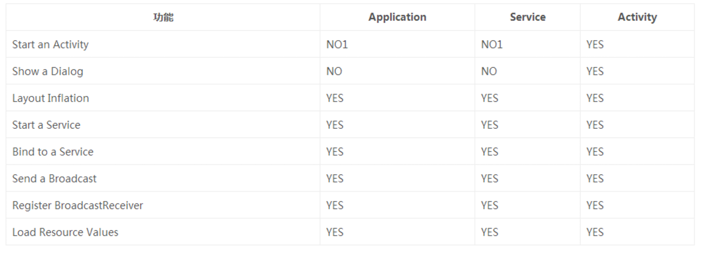

### Android内存泄漏
#### Java的四种引用
+ 强引用：JVM不会主动回收
+ 软引用：< 强引用，内存不足时会回收。只要垃圾回收器没有回收它，该对象就可以被程序使用。`如果软引用所引用的对象被垃圾回收器回收，JVM会把这个软引用加入到与之关联的引用队列中`
+ 弱引用：< 软引用，不管内存空间是否足够，都会被回收。`如果弱引用所引用的对象被垃圾回收器回收，JVM会把这个弱引用加入到与之关联的引用队列中`
+ 虚引用：和没有引用一样，必须和引用队列一起使用。[`当Java回收一个对象时，如果发现他有虚引用，JVM会在回收对象之前将它的虚引用加入到与之关联的引用队列中。可以通过该特性在一个对象被回收之前采取措施`]

#### Java GC
+ 曾经的GC算法：引用计数[`清除引用为0的对象，无法解决循环引用问题`]
+ 现代的GC算法
	+ 标记回收算法：从`GC Roots`集合开始，将内存整个遍历一次，保留所有可以被GC Roots直接或者间接引用到的对象，而剩下的对象都当作垃圾对待回收，这个算法需要中断进程内其它组件的执行并且可能产生内存碎片
	+ 复制算法：将现有的内存空间分为两块，每次只使用其中一块，在垃圾回收器回收时将正在使用的内存中的存活对象复制到未被使用的内存块中，之后清除正在使用的内存块中所有的对象，交换两个内存的角色，完成垃圾回收
	+ 标记-压缩算法：先从根节点开始对所有可达对象做一次标记，但之后，它并不简单地清理未标记的对象，而是将所有的存活对象压缩到内存的一段。之后，清理边界外所有的空间。这种方法既避免了碎片的产生，又不需要两块相同的内存区域，性价比较高
	+ 分代：将所有的新建对象都放入称为年轻代的内存区域，年轻代的特点是对象会很快回收，因此，在年轻代就选择效率较高的复制算法。当一个对象经过几次回收后依然存活，对象就会被放入称为老生代的内存空间。[`新生代—复制算法，老年代—标记-压缩算法`]

	
### 常见内存泄漏
+ 单例模式造成的内存泄漏：`单例的静态特性使得单例的生命周期和应用的生命周期一样长`
+ 非静态内部类创建静态实例造成的内存泄漏：``
+ Handler造成的内存泄漏[`静态内部类+弱引用，onDestroy: mHandler.removeCallbacksAndMessages(null)或者removeCallbacks/Messages——移除指定Runnable/Message`]
+ 线程造成的内存泄漏：`静态内部类+弱引用`
+ 资源未关闭造成的内存泄漏：`BroadcastReceiver/ContentObserver/File/Cursor/Stream/Bitmap等`

#### 内存泄漏优化建议
+ 对于生命周期比Activity长的对象如果需要Context时应该使用ApplicationContext
+ 涉及Context时优先考虑ApplicationContext
	+ Application/Sevice/Activity三者的Context的应用
	
+ 对于需要在静态内部类中使用非静态外部成员变量：`Context/View等`，使用弱引用来引用外部类的变量来避免内存泄漏
+ 对于生命周期比Activity长的内部类对象，并且内部类使用了外部类的成员变量。
	+ 将内部类改为静态内部类
	+ 静态内部类中使用弱引用来引用外部类成员变量
+ 对于不再需要使用的对象，显示的将其赋值为null
+ 保持对对象生命周期的敏感。特别注意单例、静态对象、全局性集合等生命周期 
