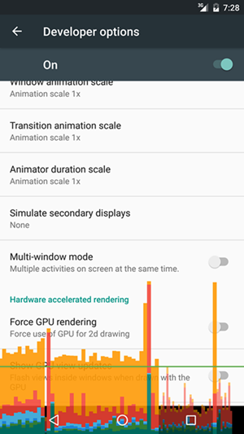
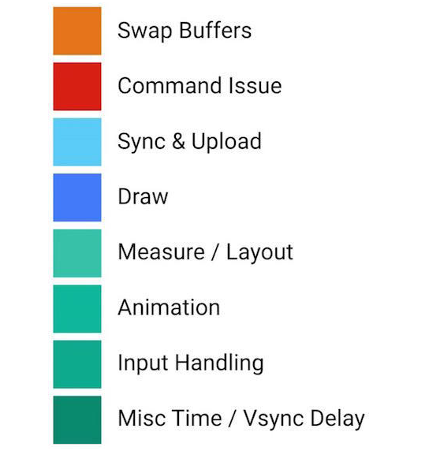
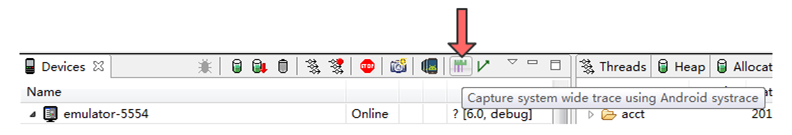
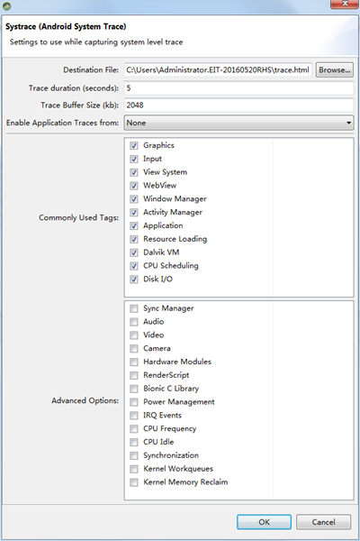
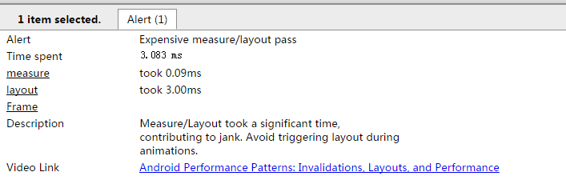
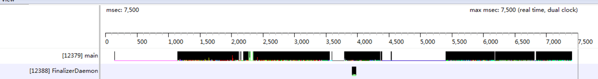
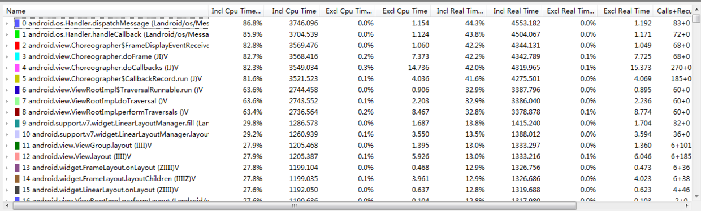
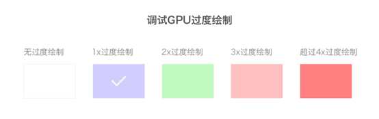

# Android性能优化

## 绘制优化

+ 绘制渲染时间：16ms = (1000ms/60)
	+ 渲染过程：`Android系统每隔16ms发出VSYNC（垂直同步）信号，触发对UI进行渲染。`
	+ 界面卡顿： `如果某个操作在24ms才能完成操作，则会发生丢帧，会导致用户在32ms中看到同一帧画面。`
	+ 卡顿原因：
		+  布局Layout过于复杂，无法在16ms内完成渲染
		+  同一时间动画执行的次数过多，导致CPU或GPU负载过高
		+  View过度绘制，导致某些像素在同一帧时间内被毁之多次
		+  UI线程中做了耗时操作
	+ 定位方式：Profile GPU Redering ---> On Screen as bars（4.1——开发者选项） 
	+ Profile GPU Rendering：`界面渲染问题`
		+ 示例图

		 
		
		+ 颜色柱说明
			+ 绿色横线：`警戒线，一旦超过则意味着时长超过了16ms` 
			+ 橙色：`处理时间`（CPU告诉GPU渲染一帧的地方，是一个阻塞调用，因为CPU会一直等待GPU发出接到命令的回复，如果橙色柱状图很高，则表示GPU很繁忙）
			+ 红色：`执行时间`（是Android进行2D渲染Display List的时间。如果红色柱状图很高，可能是由重新提交了视图而导致。还有复杂的自定义View也会导致红的柱状图变高）
			+ 蓝色：`测量绘制时间 `（创建和更新Display List的时间。如果蓝色柱状图很高，可能是需要重新绘制或者View的onDraw方法处理事情太多）

		+ Android 6.0颜色柱说明
		
		
			
		+ Swap Buffers：`处理时间，同橙色`
		+ Command Issue：`执行时间，同红色`
		+ Sync & Upload：`准备当前界面上有待绘制的图片所耗费的时间`（减少屏幕上的图片数量或者是缩小图片的大小——减少该区域的执行时间）
		+ Draw：`测量和绘制视图列表所需时间，同蓝色`
		+ Measure／Layout：`表示布局的onMeasure与onLayout所花费的时间`
		+ Animation：`表示计算执行动画所需要花费的时间`
		+ Input Handling：`表示系统处理输入事件所耗费的时间，粗略等于对事件处理方法所执行的时间`
		+ Misc Time/Vsync Delay：`表示在主线程执行了太多的任务，出现掉帧`

	+ Hierarchy Viewer：`查看布局层次`	
	+ Systrace：`4.1新增数据采样和分析工具。帮助Android关键子系统（SurfaceFlinger、WindowManagerService等Framework部分关键模块、服务，View体系系统等）运行信息`
		
		+ 跟踪系统的I/O操作
		+ 内核工作队列
		+ CPU负载
		+ Android各个子系统的运行状况
		+ UI显示性能，比如动画播放不流畅、渲染卡顿等问题提供分析数据  
	+ Systrace使用（`从系统角度返回一些信息，只能提供一个概览，深度有限。如果要详细分析——TraceView`）
		+ DDMS使用Systrace
			+ AS Tool ---> Android Device Monitor
			
			+ 点击Systrace按钮进入抓取设置界面 
			
			+ 完成设置，生成`trace.html`文件
			+ 使用`Chrome`打开`trace.html`文件进行分析
		+ 用命令使用Systrace：`Android提供python脚本文件systrace.py，位于Android SDK 目录/platform-tools/systrace中`
			+  进入目录：`cd android-sdk/platform-tools/systrace`
			+  执行python命令：`python systrace.py --time=10 -o newtrace.html sched gfx view wm`
		+ 在代码中使用Systrace：`Android4.3及以上版本使用TraceCompat类`
			+ TraceCompat.beginSection()：`开始进入追踪`
			+ TraceCompat.endSection()：`结束追踪` 
		+ Chrome分析Systrace文件
			+ Alert区：`标记性能又问题的点，单击叹号图标就可以查看某个Alert问题描述`
			
			 
			
			+ CPU区域：`CPU核心和执行任务时间片`
			+ 应用区域：`应用的帧数分析——渲染时间分析`
			+ Alerts总体分析：`警告类型，以及出现的次数`
	+ TraceView ：`Android SDK中自带数据采集和分析工具`
		+ TraceView得到数据 
			+ 单次执行耗时的方法
			+ 执行多次的方法 
		+ 获取trace文件
			+ DDMS中获取
				+ AS Tools --> Android Device Monitor --> Start Method Profiling --> 选择监测应用 --> Stop Method Profiling 
			+ 代码中加入调试语句
			
			```java
			// 需要添加<uses-permission android:name="android.permission.WRITE_EXTERNAL_STORAGE"/>权限
			Debug.startMethodTracing();
			...
			Debug.stopMethodTracing();
			```   
		+ 分析trace文件
			+ 时间片面板
		
			+ 分析面板 	
		
			+ 列数据说明
			
			|列名|含义|
			| :---: | :---:|
			|Name|该线程运行过程中调用的函数名|
			|Incl Cpu Time%|某个方法包括其内部调用的方法所占用CPU时间百分比|
			|Excl Cpu Time%|某个方法不包括其内部调用的方法所占用CPU时间百分比|
			|Incl Real Time%|某个方法包括其内部调用的方法所占用真实时间百分比|
			|Excl Real Time%|某个方法不包括其内部调用的方法所占用真实时间百分比|
			|Calls + Recur Calls / Total|某个方法次数+递归调用次数|
			|Cpu Time / Call|该方法平均占用CPU时间|
			|Real Time / Call|该方法平均占用真实时间|
			|Incl Cpu Time|某个方法包括其内部调用的方法所占用CPU时间|
			|Excl Cpu Time|某个方法不包括其内部调用的方法所占用CPU时间|
			|Incl Real Time|某个方法包括其内部调用的方法所占用真实时间|
			|Excl Real Time|某个方法不包括其内部调用的方法所占用真实时间|

+ 过度绘制
	+ 检测：`在开发者模式中打开调试GPU过度绘制选项`
	+ 色块说明
		
		+ 原色：没有过度绘制——每个像素在屏幕上绘制一次
		+ 蓝色：一次过度绘制（两次，`最理想，蓝色为主`）
		+ 绿色：两次过度绘制（三次，`绿色以上区域不能超过整体三分之一`）
		+ 粉色：三次过度绘制
		+ 红色：四次或四次以上过度绘制
	+ 避免方案 
		+ 移除不需要的background
		+ 在自定义View的OnDraw方法中，用canvas.clipRect来指定绘制的区域，防止重叠的组建发生过度绘制 
+ 布局层级
	+ Include
	+ Merge 
	+ ViewStub：延迟加载（ViewStub不能嵌套Merge标签）
+ 优化工具
	+ Hierarchy Viewer：`可视化调试工具，检查布局嵌套和绘制时间`
	+ Android Lint：`代码扫描工具，通过代码静态检查发现代码潜在问题，给出优化建议`
		+ 检查范围 
			+ 正确性
			+ 安全性
			+ 性能
			+ 可用性
			+ 可达性
			+ 国际化
		+ 操作：`AS Analyze --> Inspect Code` 
	 
## 内存优化

+ 检测内存的工具
	+ `Memory Monitor`：跟踪整个App的内存变化情况
	+ `Heap Viewer`：查看当前内存快照，便于对比分析哪些对象可能发生了泄漏
	+ `Allocation Tracker`：跟踪内存对象的来源 
+ 优化方向
	+ 内存泄漏
	+ 内存溢出

## 耗电优化

+ 耗电检测：`第三方检测电量设备——第三方硬件监测的时候用的是自己设备供电而不是手机的电量`
+ 手机耗电量较大的点
	+ 唤醒屏幕
	+  CPU唤醒使用
	+  蜂窝式无线
+ Battery Historian：`电量数据收集工具（Android 5.0及以上设备，允许通过adb命令dump出电量使用统计信息）`
	+ 操作流程
		+ reset：`adb shell dumpsys batterystats --reset`
		+ 断开测试设备，操作待测试App
		+ 重新连接设备，使用adb命令导出相关统计数据：`adb bugreport > bugreport.txt // 此命令持续记录输出，想要停止记录时按Ctrl+C退出`
+ 电量优化方式
	+ 计算、内存、渲染等优化
	+ 监听手机充电状态：`USB／AC／WireLess`   
	+ 屏幕唤醒
		+ 保持屏幕常亮
			+ Activity中使用FLAG_KEEP_SCREEN_ON的Flag
			+ 布局文件中使用`android:keepScreenOn`属性  
	+ WakeLock：`相对系统休眠而言，程序给CPU加上WakeLock后系统就不会休眠。对电池续航影响较大。一般用在使用后台服务在屏幕关闭情况下hold住CPU完成一些工作` 
		+ 类型

		|标记值| CPU | 屏幕 | 键盘|
		| :--: | :--: | :--: | :--: |
		|PARTIAL\_WAKE\_LOCK|开启|关闭|关闭
		|SCREEN\_DIM\_WAKE\_LCOK|开启|变暗|关闭
		|SCREEN\_BRIGHT\_WAKE\_LCOK|开启|变亮|关闭
		|FULL\_WAKE\_LCOK——API17被弃用FLAG\_KEEP\_SCREEN\_ON|开启|变亮|变亮
		
	+ JobScheduler：`Android 5.0，执行后台工作首选方式`
	+ GPS：`选择合适的Location Provider`
		+ `GPS_PROVIDER`：GSP定位，耗电大，精度高（10m），在室内基本无效
		+ `NETWORK_PROVIDER`：网络定位，定位精确度取决于将基站或WI-FI节点信息翻译成位置信息的服务器的能力
		+ `PASSIVE_PROVIDER` ：被动定位。使用其他应用保留的定位信息
	+ 传感器：`使用传感器时，选择合适的采样率，越高的采样率类型则越费电——后台时注意注销传感器监听`
		+ `SENSOR_DELAY_NOMAL (200000微秒)`
		+ `SENSOR_DELAY_UI (60000微秒)`  
		+ `SENSOR_DELAY_GAME (20000微秒)`
		+ `SENSOR_DELAY_FASTEST (0微秒)`

##	数据库优化

+ 建立索引
	+ 优点：`加速检索数据表的速度`
	+ 缺点 
		+ 对于增加、更新和删除来说，使用索引会变慢
		+ 建立索引会增加数据库大小
	+ 创建索引
		+ `CREATE INDEX index_name ON table_name;`
		+ `CREATE INDEX index_name ON table_name (column_name);`  
+ 编译SQL语句：`SQLite想要执行操作，需要将程序中sql语句变异成对应的SQLiteStatement。对于批量插入或者更新操作，使用显示编译来做到重用SQLiteStatement`  
	+ 编译sql语句获得SQLiteStatement对象，参数使用？代替
	+ 在循环中对SQLiteStatement对象进行具体数据绑定，bind方法中的index从1开始，而不是0
+ 显式使用事务
+ ContentValues的容量调整：`设置合理的初始化容量`
+ 及时关闭Cursor
+ 耗时异步化
