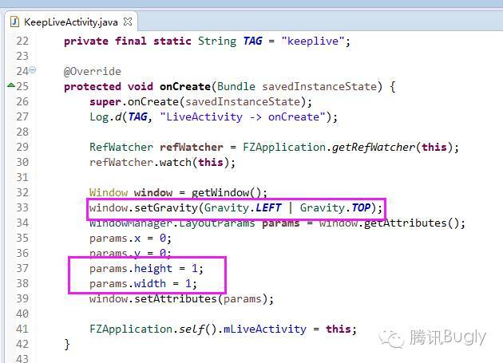
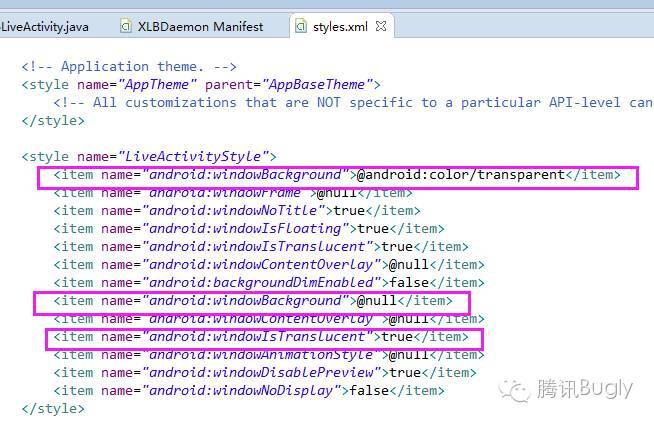
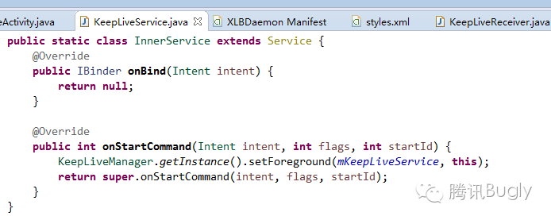
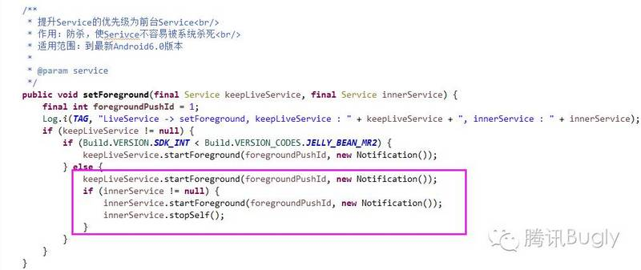
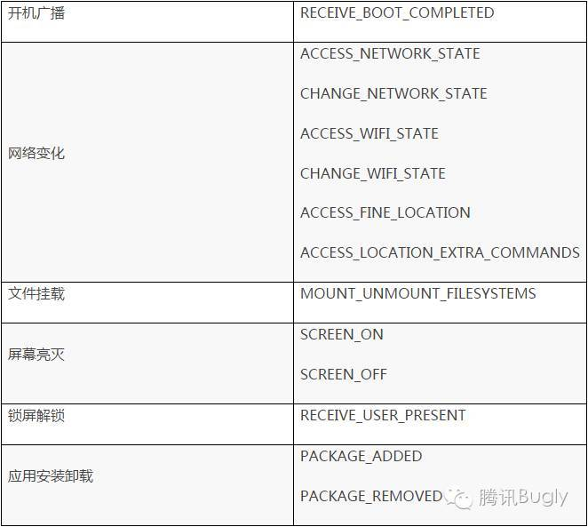
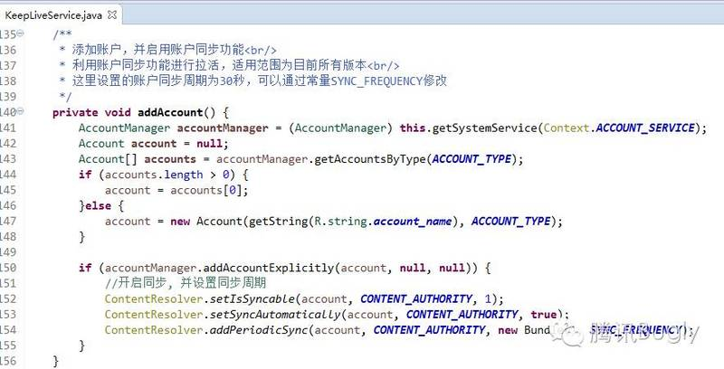
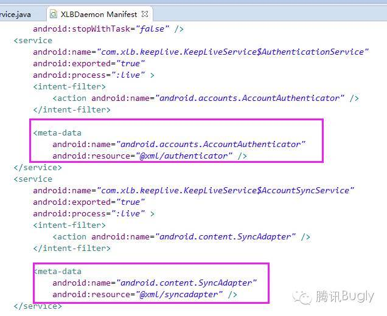

## Android进程保活

### 简介
+ 黑色保活：不同的app进程，利用广播互相唤醒（包括利用系统提供的广播进行唤醒）
+ 白色保活：启动前台Service
+ 灰色保活：利用系统漏洞启动前台Service
+ oom_adj：是Linux内核分配给每个系统进程的一个值，代表进程的优先级，进程回收机制就是根据这个优先级来决定是否进行回收
	+ 进程的oom_adj越大，表示此进程优先级越低，越容易被杀死回收。越小，表示进程优先级越高，越不容易杀死回收
	+ 普通app进程的oom_adj >= 0，系统进程的oom_adj才有可能< 0
	+ 查看进程优先级（oom_adj）命令
		+ adb shell（进入shell命令模式） 
		+ ps | grep PackageName
		+ cat /proc/进程ID/oom_adj  
	+ oom_adj说明[`红色部分容易被杀死，绿色部分不容被杀死，其他表示非Android进程（纯Linux进程）`]

	+ Android手机中进程被杀死可能情况

### 提升进程优先级的方案
+ 利用Activity提升权限
	+ 设计思想：`监控手机锁屏解锁事件，在屏幕锁屏时启动1个像素的Activity，在用户解锁时将Activity销毁掉。将该Activity设计成用户无感知。通过此方案可以使进程的优先级在屏幕锁屏时间由4提升为最高优先级1` 
	+ 适用范围
		+ 适用场景：`本方案主要解决第三方应用及系统管理工具在检测到锁屏事件后一段时间（一般为五分钟以内）内会杀死后台进程，以达到省电的目的问题`
		+ 适用版本 ：适用于所有的Android版本
	+ 具体实现
		+ 定义Activity，并设置Activity的大小为1像素

		+ 从AndroidManifest中通过如下属性，排除Activity在RecentTask中的显示

		+ 设置Activity为透明

		+ Activity启动与销毁控制 

+ 利用Notification提升权限
	+ 设计思想：Android中Service的优先等级为4，通过setForeground接口可以将后台Service设置为前台Service，使进程的优先级由4提升为2，从而使进程的优先级仅仅低于目前正在交互的进程，与可见进程优先级一致。使得进程被杀死的概率大大降低
	+ 实现挑战：从Android 2.3开始调用setForeground将后台的Service设置为前台Service时，必须在系统的通知栏发送一条通知，即前台Service必须与一条可见的通知栏绑定在一起。`该方案对不需要常驻通知栏的应用来说，无法直接使用`
	+ 应对措施：`通过实现一个内部Service，在LiveService和其内部Service中同时发送具有相同ID的Notification，然后将内部Service结束掉。随着内部Service的结束，Notification将会消失，但系统优先级依然保持为2`
	+ 适用范围：适用于目前已知所有版本
	+ 具体实现 

### 进程死后拉活方案
+ 利用系统广播拉活
	+ 设计思想：`发生在特定系统事件时，系统会发出响应广播，通过在AndroidManifest中静态注册对应的广播监听器，即可在发生响应事件时拉活`
	+ 常见用于拉活的广播事件

	+ 方案适用范围：适用于全部Android平台
	+ 优缺点
		+ 广播接收器被管理软件、系统软件通过“自启管理”等功能禁用的场景无法接收到广播，从而无法自启
		+ 系统广播事件不可控，只能保证发生事件时拉活进程，但无法保证进程挂掉后立即拉活 
+ 利用第三方应用广播拉活
	+ 设计思想：和接受系统广播类似，不同的是该方案为接收第三方Top应用广播
	+ 因素限制
		+ 反编译分析过的第三方应用的多少
		+ 第三方应用的广播属于应用私有，稳定性不确定  
+ 利用系统Service机制拉活
	+ 设计思想：将Service设置为`START_STICKY`。利用系统机制在Service挂掉后自动拉活

	+ 方案适用范围：`如下两种情况下无法拉活`
		+ Service第一次被异常杀死后会在5秒内重启，第二次会被杀死会在10秒内重启，第三次会在20秒内重启，一旦在短时间内Service被杀死达到5次，则系统不在拉起  
		+ 进程被取得Root权限的管理工具或系统工具通过`forestop`停止掉。无法重启
+ 利用Native进程拉活
	+ 设计思想
		+ 主要思想：利用Linux中的`fork机制`创建`Native进程`，在Native进程中监控主进程的存活，当主进程关掉后，在Native进程中立即对主进程进行拉活	
		+ 主要原则：在Android中所有进程和系统组件的生命周期受ActivityManagerService的统一管理。而且，通过Linux的fork机制创建的进程为纯Linux进程，其生命周期不受Android的管理
		+ 实现挑战
			+ 如何在Native进程中感知主进程死亡
				+ 在Native进程中通过死循环活着定时器，轮训判断主进程是否存活[`非常耗电`]
				+ 在Native进程创建一个监控文件，并且在主进程中持该文件锁
			+ 如何在Native进程中拉活主进程：`通过am命令进行拉活——通过指定“--include-stopped-packages”参数来拉活主进程`
			+ 如何保证Native进程的唯一
		+ 适用范围：Android 5.0以下版本手机效果非常好，Android 5.0以上手机部分有效。（Android 5.0系统会将Native进程内的所有进程都杀死）      
+ 利用JobScheduler机制拉活
	+ 设计思想：Android5.0以后对Native进程等加强了管理，Native拉活方式失败。Android 5.0以上系统提供了JobScheduler接口，系统会定时调用该进程以使应用进行一些逻辑操作
	+ 适用范围：Android 5.0以上版本[`仅在小米手机可能会出现无法拉活`] 
+ 利用账号同步机制拉活
	+ 设计思想：Android系统的账号同步机制会定期进行账号同步，该方案目的在于利用同步机制进行进程的拉活
	+ 适用范围：所有Android版本（Android N 无效，账户同步有变动）
	+ 实现方式

添加账号和设置同步周期的代码：
 

授权：

 
