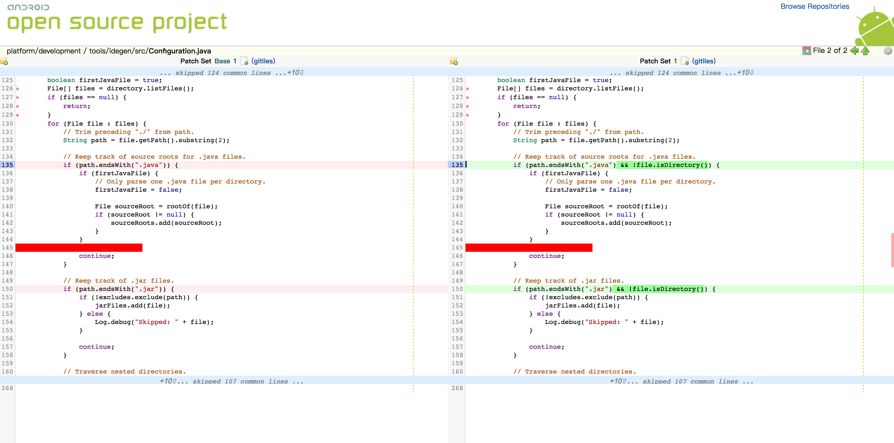

### Android Studio 阅读源码
---

+ 下载所需Android版本源码
+ 进入Android源码根目录
+ 执行`mmm development/tools/idegen/`命令：该命令表示编译idegen这个项目，生成`idegen.jar`文件
+ 执行`sh ./development/tools/idegen/idegen.sh`命令：该命令表示生成对应的文件：android.iws，android.ipr，android.iml
+ 生成对应的文件后，打开Android Studio，选择打开一个现有的Android Studio项目，选择Android源码的根目录
+ 解决C／C++查找不能跳转BUG

