# 操作系统

### 多道程序设计：
+ 概念：`指让多个程序同事进入计算机的主存储器进行计算`
+ 特点
	+ CPU与外部设备充分并行
	+ 外部设备之间充分并行
	+ 发挥CPU的使用效率
	+ 提高单位时间的算题量
+ 实现
	+ 为进入内存执行的程序建立管理实体：`进程`
	+ OS应能管理与控制进程程序的执行
	+ OS协调管理各类资源在进程间的使用
		+ 处理器的管理和调度
		+ 主存储器的管理和调度
		+ 其他资源的管理和调度
+ 实现要点
	+ 如何使用资源：调用操作系统提供的服务例程（如何陷入操作系统）
	+ 如何复用CPU：调度程序（在CPU空闲时让其他程序运行）
	+ 如何使CPU与I/O设备充分并行：设备控制器与通道（专用的I/O处理器）
	+ 如何让正在运行的程序让出CPU：中断（中断正在执行的程序，引入OS处理） 

### 命令解释程序（操作接口）
+ 处理过程
	+ OS启动命令解释程序，输出命令提示符，等待键盘中断／鼠标点击／多通道识别
	+ 每当用户输入一条命令（暂存在命令缓冲区）并按回车换行时，申请中断
	+ CPU响应后，将控制权交给命令解释程序，接着都去命令缓冲区内容，分析命令、接受参数，执行处理代码
	+ 前台命令（命令按序执行，一个命令执行后在接收新的命令）执行结束后，再次输出命令提示符，等待下一条命令
	+ 后台命令（不管命令是否结束，直接接收下一条命令）处理启动后，即可接收下条命令 

### 人机交互发展
+ WIMP界面
	+ 缘起：70年代后期`Xerox`的原型机Start
	+ 特征：窗口（`Windows`）、图标（`Icons`）、菜单（`Menu`）和指示装置（`Pointing Devices`）为基础的图形用户界面WIMP 
	+ 得益：Apple最初采用并大力推广
	+ 时间：1990年代开始广泛使用
	+ 不足：不允许同时使用多个交互通道，从而产生人-机交互的不平衡
+ 多媒体计算机
	+ 缘起：1985年的MPC
	+ 概念：把音频、视频、图形图像和人机交互控制结合起来，进行综合处理的计算机操作系统
	+ 构成：多媒体硬件平台、多媒体OS、图形用户接口、多媒体数据开发工具
	+ 提供与时间有关的时变媒体界面，既控制信息呈现，也控制何时呈现／如何呈现
	+ 人机交互界面需要使用多种媒体，同时支持多通道交互整合，改善用户体验
+ 虚拟现实系统（VR）
	+ 缘起：1980年代的虚拟现实新型用户界面
	+ VR通过计算机模拟三维虚拟世界，根据`观察点`、观察点改变的`导航`和对周围对象的`操作`，来模拟`临境`（身临其境）的感觉
	+ 支持多通道交互整合，提供良好的用户体验
	+ 支持用户主动参与的高度自然的三维HCI（人机交互），以及语音识别、头部跟踪、视觉跟踪、姿势识别等新型HCI
	+ 允许用户产生模糊和不精确的输入

## 程序接口
+ 概念
	+ 操作系统的程序接口——系统调用
	+ 操作系统实现的完成某种特定功能的过程。为所有运行程序提供访问操作系统的接口 
+ 系统调用的实现机制
	+ 陷入处理机制：计算机系统中控制和实现系统调用的机制
	+ 陷入指令：也称为访管指令，或异常中断指令。计算机系统为实现系统调用而引入处理器中断的指令
	+ 每个系统调用都事先规定了编号，并在约定寄存器中规定了传递给内部处理程序的参数
+ 系统调用的实现要点
	+ 编写系统调用处理程序
	+ 设计一张系统调用入口地址表，每个入口地址指向一个系统调用的处理程序，并包含系统调用自带参数的个数
	+ 陷入处理机制需开辟现场保护区，以保存发生系统调用时的处理器现场
+ 系统调用流程图

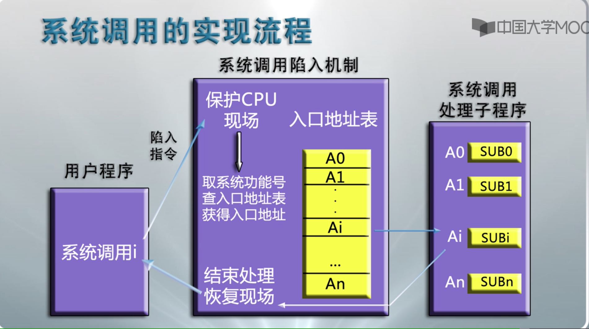     

## 系统结构
+ 操作系统软件的结构设计
	+ OS构件：内核、进程、线程、管程等 
	+ 设计概念：模块化、层次化、虚拟化
	+ 内核设计是OS设计中最为复杂的部分
+ 操作系统内核
	+ 单内核（`主体`）：内核中各部件杂然混居的形态，始于1960年代，广泛使用。如Unix／Linux，及Windows（自称采用混合内核的CS结构）
	+ 微内核：1980年代始，强调结构性部件与功能性部件的分离（以进程的方式运行与操作系统之外），大部分OS研究都集中在此（`由于效率问题，只存在于研究领域，市场上不采用`）
	+ 混合内核：微内核和单内核的折中，较多组建在核心态中运行（`Windows，提升有限`）
	+ 外内核：尽可能减少内核的软件抽象化和传统微内核的消息传递机制，使得开发者专注于硬件的抽象化；部分嵌入式系统使用
+ 操作系统结构层次图

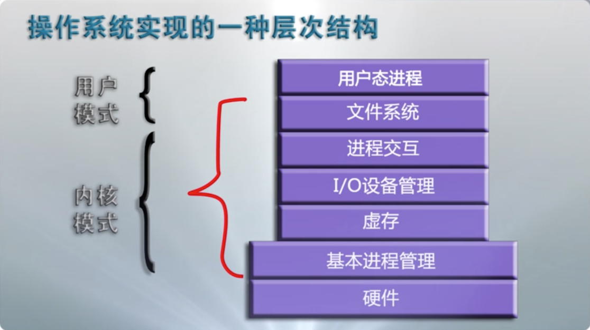 

详细图：

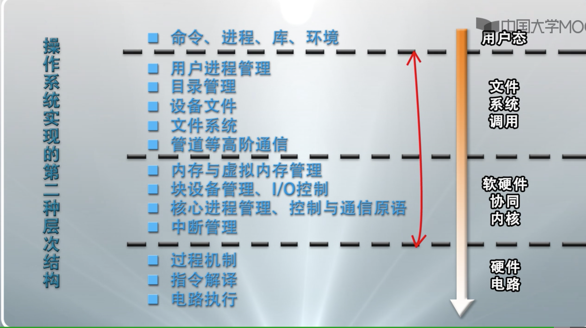

## 处理器与寄存器
+ 处理器（CPU）部件示意图

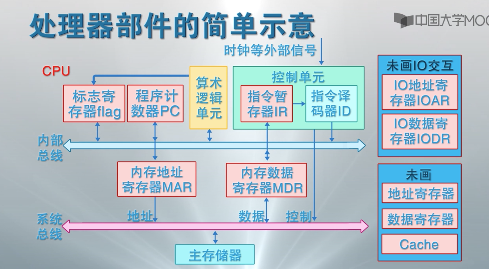

+ 寄存器
	+ 用户程序可见寄存器
		+ 可以使程序源码减少访问主存储器的次数，提高指令执行的效率
		+ 所有程序可使用，包括应用程序和系统程序
		+ 分类
			+ 数据寄存器：又称为通用寄存器（`AX,BX,CX,DX`）
			+ 地址寄存器：索引（`SI、DI`）、栈指针（`SP、BP`）、段地址（`CS、DS、SS、ES`）等寄存器   
			+ 控制与状态寄存器
				+ 用于控制处理器的操作，主要被具有有特权的操作系统程序使用，以控制程序的执行
				+ 程序计数器PC：存储将取指令的地址
				+ 指令寄存器IR：存储最近使用的指令
				+ 条件码CC：CPU为指令操作结果设置的位，标志正、负、零、溢出等结果
				+ 标志位：中断位、中断允许位、中断屏蔽位、处理器模式位、内存保护位等等
	+ 程序状态字PSW
		+ 操作系统中指记录当前程序运行的动态信息，通常包含:
			+ 程序计数器，指令寄存器，条件码
			+ 中断字，中断允许/禁止，中断屏蔽，处理器模式，内存保护，调试控制
		+ PSW也是计算机系统的寄存器
			+ 通常设置一组控制与状态寄存器
			+ 也可以专设一个PSW寄存器（极少操作系统）
+ 机器指令
	+ 机器指令是计算机系统执行的基本命令，是中央处理器执行的基本单元
	+ 指令由一个或多个字节组成，包括操作码字段、一个或多个操作数地址字段、以及一些表征机器状态的状态字及特征码
	+ 指令完成各种算数逻辑运算、数据传输、控制流跳转征码
+ 指令执行过程（流水线方式，提升效率）
	+ 取指：根据PC从存储器或高速缓冲存储器中取指令到IR
	+ 解码：解释IR中的指令来决定其执行行为
	+ 执行：连接到CPU部件，执行运算，产生结果并写回，同时在CC里设置运算结论标志，跳转指令操作PC，其他指令递增PC值
+ 特权指令/非特权指令
	+ 特权指令：只能被操作系统内核使用的指令
	+ 非特权指令：只能被所有程序使用的指令
+ 处理器模式（`现代操作系统只使用0和3两种模式，对应于内核模式和用户模式`）
	+ 计算机通过设置处理器模式实现特权指令管理
	+ 0，1，2，3四种运行模式
		+ `0模式`：操作系统内核，可以执行全部指令
		+ `1模式`：系统调用
		+ `2模式`：共享库程序
		+ `3模式`：用户程序，只能执行非特权指令

+ 模式切换：“用户模式 <---> 内核模式”
	+ `中断、异常或系统异常`等时间导致用户程序向OS内核切换，触发`用户模式 ---> 内核模式`
		+ 程序运行时发生并响应中断
		+ 程序运行时发生异常
		+ 程序请求操作系统服务 
	+ OS内核处理完成后，调用中断返回指令触发：`内核模式 ---> 用户模式` 

+ 中断：`激活操作系统的唯一方式`
+ 中断系统
	+ 硬件子系统：中断响应
	+ 软件子系统：中断处理
+ 中断装置：计算机系统中发现并响应中断/异常的硬件装置
+ 中断装置因计算机而异，通常有：
	+ 处理器外的中断：由中断控制器发现和响应
	+ 处理器内的异常：由指令的控制逻辑和现实线路发现和响应，相应机制成为陷阱
	+ 请求OS服务的系统异常：处理器执行陷入指令时直接触发，相应机制称为系统陷阱  
+ 流程图

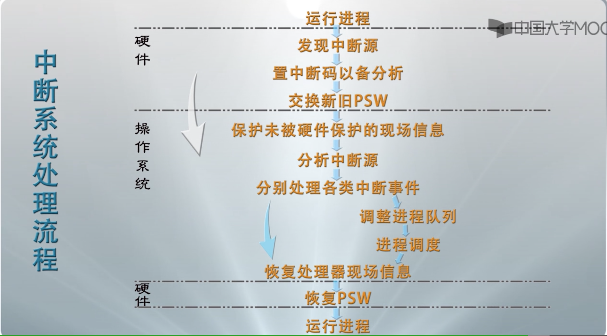 

+ 中断优先级
	+ 一种可能的处理次序
		1. 处理机硬件故障中断事件
		2. 自愿性中断事件
		3. 程序性中断事件
		4. 时钟中断等外部中断事件
		5. 输入输出中断事件
		6. 重启动和关机中断事件
	+ 不同的操作系统有不同的处理次序
	+ 中断嵌套处理机制限制：3层
	+ 决定中断处理次序的因素
		+ 中断屏蔽
		+ 中断优先级
		+ 中断嵌套处理

+ 进程
	+ 概念 
		+ 是一个具有一定独立功能的程序关于某个数据集合的一次运行活动
		+ 是操作系统进行资源分配和调度的一个独立单位
	+ 五个实体
		+ （OS管理运行程序的）数据结构P
		+ （运行程序的）内存代码C
		+ （运行程序的）内存数据D
		+ （运行程序的）通用寄存器信息R
		+ （OS控制程序执行的）程序状态字信息PSW 
	+ 概念级的进程状态
		+ 运行态：指进程占有处理器运行
		+ 就绪态：指进程具备运行条件等待处理器运行
		+ 等待态：指进程由于等待资源、输入输出、信号等而不具备运行条件
	+ 进程三态模型

	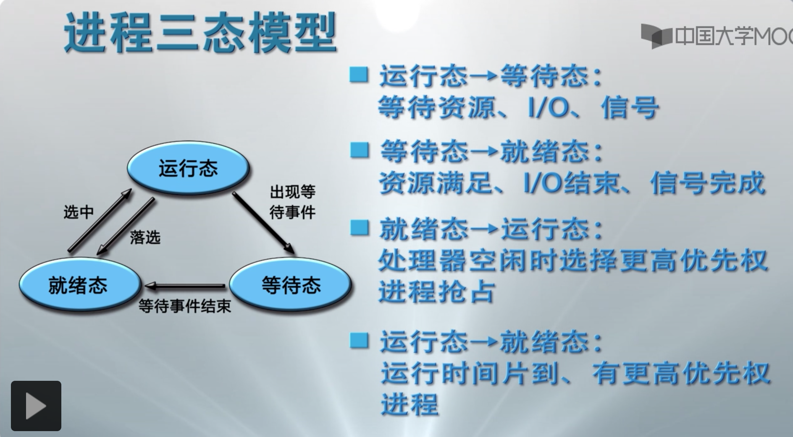    
	
	+ 进程挂起
		+ 产生原因：`OS无法预期进程的数目与资源需求，计算机系统在运行过程中可能出现资源不足的情况。主要表现为性能低和死锁`
		+ 解决办法：`进程挂起——剥夺某些进程的内存及其他资源，调入OS管理的对换区，不参加进程调度，待适当时候再调入内存、恢复资源、参与运行` 
		+ 挂起与等待状态的区别：`有本质区别，等待状态占有已申请的资源处于等待状态，挂起状态没有任何资源`
		+ 进程挂起的选择与恢复
		
		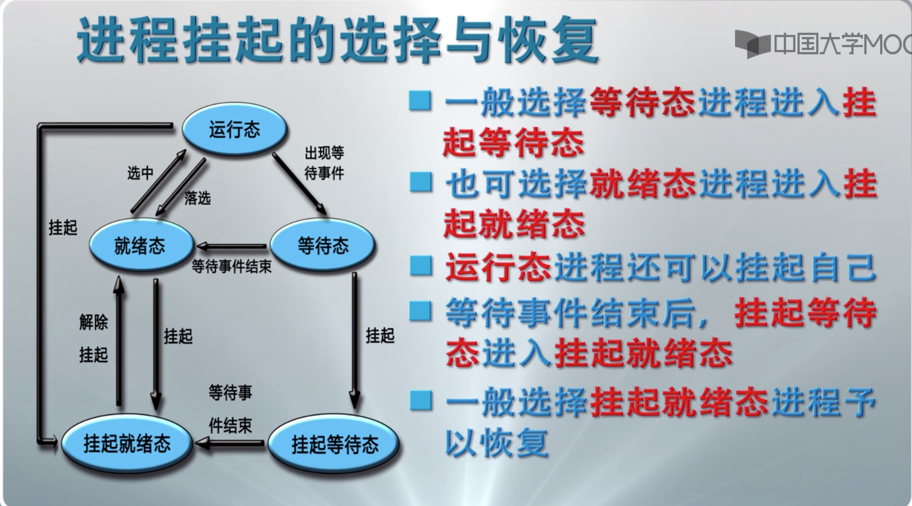   
	
	+ 进程控制块
	
	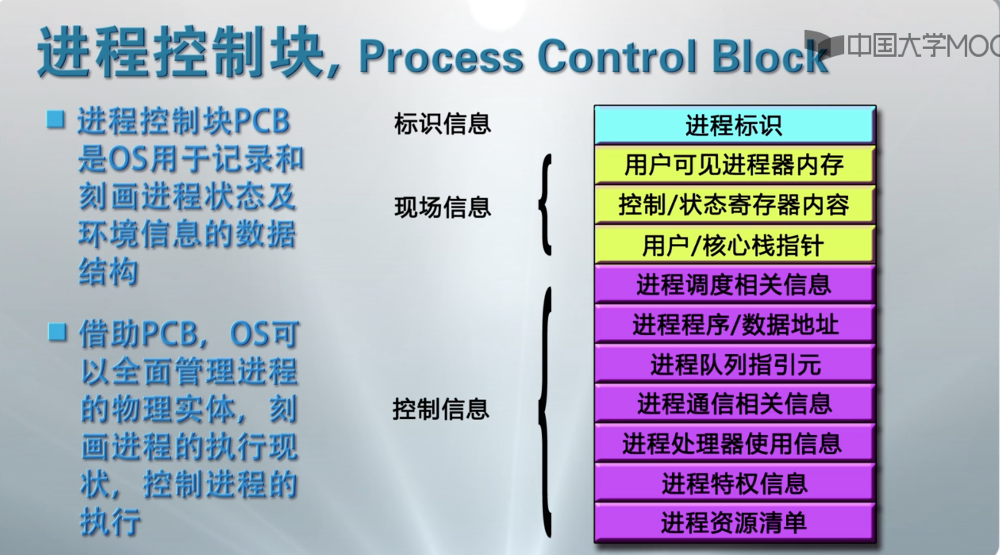
	
	+ 进程映像：某一时刻进程的内容及其执行状态集合，是内存级的物理试题，又称为进程内存映像映像
		+ 进程控制块：保存进程的标识信息、状态信息和控制信息
		+ 进程程序块：进程执行的程序空间
		+ 进程数据块：进程处理的数据空间，包括数据、处理函数的用户栈和可修改的程序
		+ 核心栈：进程在内核模式下运行时使用的堆栈，中断或系统过程使用 
	+ 进程内存映像示意图
	
	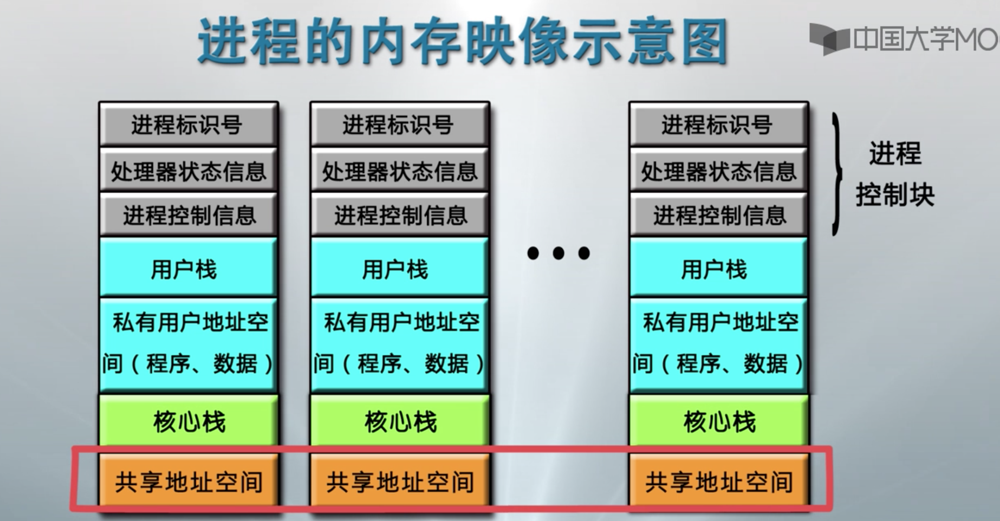
	
	+ 进程上下文：OS中的进程物理实体和支持进程运行的环境
		+ 用户级上下文：用户程序块、用户数据区、用户栈、用户共享内存
		+ 寄存器上下文：PSW、栈指针、通用寄存器
		+ 系统级上下文：PCB、内存区表、核心栈
		
+ 进程管理
	+ 概念级的OS进程管理软件
		+ 系统调用、中断、异常处理程序
		+ 队列管理模块
		+ 进程控制程序
		+ 进程调度程序（独立进程居多）
		+ 进程通信程序（多个程序包）
		+ 终端登录与作业控制程序、性能监控程序、审计程序等外围程序
	+ 进程实现的队列模型
	
	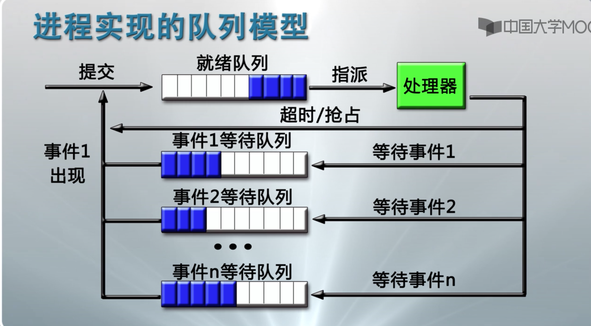
	
	+ 进程控制流程
		+ 进程创建：进程表加一项，申请PCB并初始化，生成标识，建立映像，分配资源，移入就绪队列
		+ 进程撤销：从队列中移除，归还资源，撤销标识，回收PCB（进程控制块），移除进程表项
		+ 进程阻塞：保存现场信息，修改PCB，移除等待队列，调度其他进程执行
		+ 进程唤醒：等待队列中移除，修改PCB，移除就绪队列（该进程优先级高于运行进程时触发抢占）
		+ 进程挂起：修改状态并出入相关队列，收回内存等资源送至兑换区
		+ 进程激活：分配内存，修改状态并出入相关队列
	+ 原语：由若干条指令构成的完成某种特定功能的程序，执行上具有不可分割性。（进程控制核心数据应该采用原语，防止与时间有关的错误）
		+ 实现方式：关中断实现
			+ 入原语前关闭中断
			+ 出原语后开启中断
			
+ 进程切换/模式切换
	+ 进程切换：`指从正在运行的进程中回收处理器，让待运行进程来占有处理器运行。实质上就是被中断运行进程与待运行进程的上下文切换`  
		+ 进程切换过程：`必须在操作系统内核模式下完成，需要用到模式切换`
			+ 保存被中断进程的上下文
			+ 转向进程调度
			+ 恢复待运行进程的上下文     
	+ 模式切换：`处理器状态切换`
		+ 模式切换过程
			+ 用户模式到内核模式中断、异常、系统调用：中断用户进程执行而触发
			+ 内核模式到用户模式OS执行中断返回指令：将控制权交还用户进程而触发
		+ 模式切换基本任务
			+ 正向模式切换
				+ 处理器模式转为内核模式
				+ 保存当前进程的PC、PSW值到核心栈
				+ 转向中断、异常、系统调用处理程序 
			+ 逆向模式切换     
				+ 从待运行进程核心栈中弹出PSW、PC值
				+ 处理器模式转为用户模式
	+ 进程切换的发生时机：`一定发生在中断/异常/系统调用处理过程中，但是某些中断不会引起进程状态转换`
		+ 阻塞式系统调用、虚拟地址异常导致被中断进程进入等待态
		+ 时间片中断、I/O中断后发现更高优先级进程导致被中断进程转入就绪态
		+ 终止用系统调用、不能继续执行的异常导致被中断进程进入终止态

		
+ 多线程技术
	+ `单线程结构进程`：传统进程
	
	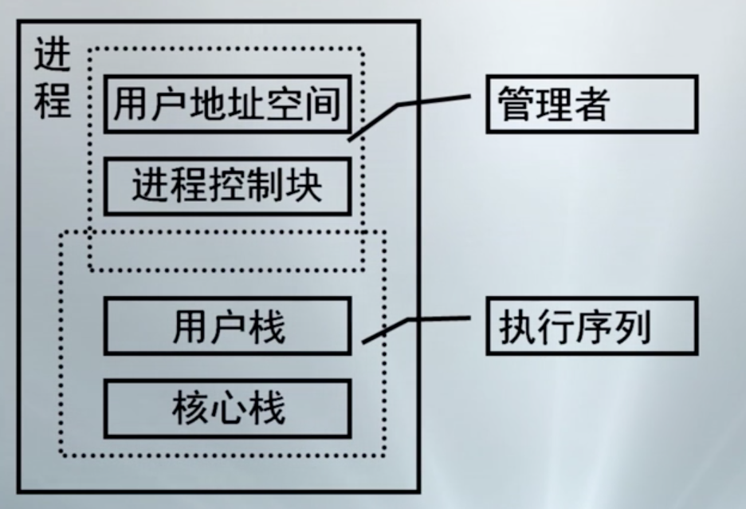
	
	+ `多线程结构进程`

	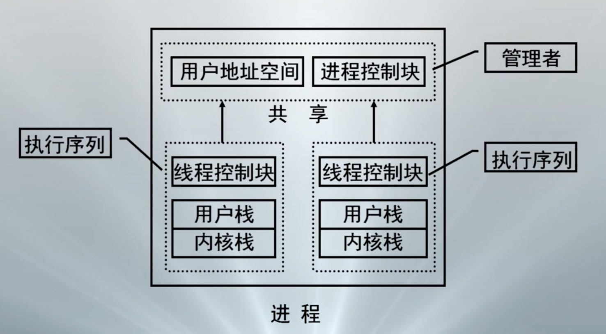 
	
	+ 线程概念：`是进程的一条执行路径，是调度的基本单位，同一个进程中的所有线程共享进程获得的主存空间和资源`
		+ 线程执行状态
		+ 受保护的线程上下文，当线程不运行时，用于存储现场信息
		+ 独立的线程指令计数器
		+ 执行堆栈
		+ 容纳局部变量的静态存储器
	+ 线程状态：`运行、就绪和睡眠，无挂起（挂起状态与资源有关，只有进程才有挂起状态）`
	+ 与线程状态变化有关的线程操作：`孵化、封锁、活化、剥夺、指派、结束`
  
+ 内核级多线程：`KLT（Kernel-Level Threads）—— 解决物理并行性问题（利用多个处理器处理问题）`
	+ `核心`
		+ 线程管理的所有工作由OS内核来做
		+ OS提供了一个应用程序设计接口API，供开发者使用KLT
		+ OS直接调度KLT

	+ `特点`
		+ 进程中的一个线程被阻塞了，内核能调度同一进程的其他线程占有处理器运行
		+ 多处理器环境中，内核能同时调度同一进程中多个线程并行执行
		+ 内核自身也可以用多线程技术实现，能提高操作系统的执行速度和效率
		+ 应用程序线程在用户态运行，线程调度和管理在内核实现，在同一进程中，控制权从一个线程传送到另一个线程时需要模式切换，系统开销较大

+ 用户级线程：`UIL（User-Level Threads）—— 处理逻辑并行性问题`
	+ `核心`
		+ 用户空间运行的线程库，提供多线程应用程序的开发和运行支撑环境工作由OS内核来做
		+ 任何应用程序均需通过线程库进行程序设计，在与线程库连接后运行
		+ 线程管理的所有工作都由应用程序完成，内核没有意识到线程的存在
	+ `特点`
		+ 所有线程管理数据结构均在进程的用户空间中，线程切换不需要内核模式，能节省模式切换开销和内核的宝贵资源
		+ 允许进程按应用特定需要选择调度算法，甚至根据应用需求裁剪调度算法
		+ 能运行在任何OS上，内核在支持ULT方面不需要任何工作
		+ 不能处理多处理器的优点，OS钓鱼进程仅有一个ULT能执行
		+ 一个ULT的阻塞，将引起整个进程的阻塞
	+ Jacketing技术
		+ 把阻塞式系统调用改造成非阻塞式的
		+ 当线程陷入系统调用时，执行jacketing程序
		+ 由jacketing程序来检查资源使用情况，以决定是否执行进程切换或传递控制权给另一个线程
	
	+ KLT VS ULT
	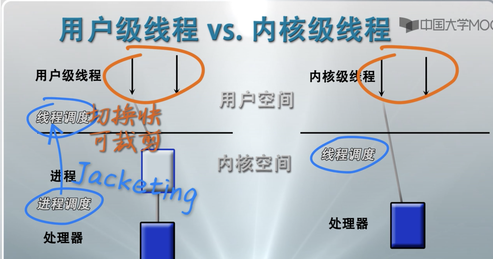   